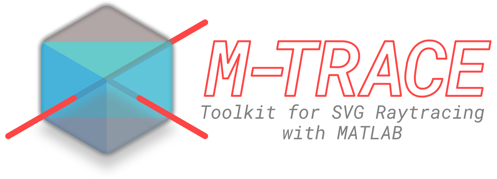

<picture>
 <source media="(prefers-color-scheme: dark)" srcset="./img/logo_dark.png">
 <source media="(prefers-color-scheme: light)" srcset="./img/logo_light.png">
 
</picture>

# M-TRACE

*Please note, this README is under development.*

M-TRACE (a.k.a., the MATLAB toolkit for raytracing animations in a canvas environment) is a simulation tool for students, scientists, and engineers for performing non-sequential 2D raytracing through code-driven animations.

Simulations in M-TRACE are created using SVG (scalable vector graphics) files that can be created using illustration tools like [Inkscape](https://inkscape.org/) and Adobe Illustrator. These simulations may be run directly (static), or combined with dedicated script files to implement custom animations.

## Installation
Simply download the files contained in the `m_trace` directory (or download a ZIP archive of this repository). The folder contains a collection of MATLAB script files that comprise the M-TRACE toolbox.

M-TRACE was developed and tested using MATLAB version R2021B.

## Usage
Check out the `examples` folder for a collection of example SVG files and corresponding MATLAB script files.

To run the examples (within MATLAB):
1. Add all script files in the `m_trace` folder to the current path.
2. Open and run the corresponding script file.

## Documentation
A paper describing the use and features of M-TRACE is forthcoming.

## Acknowledgments
Thanks go out to Madhu Beniwal, Cheng Jiang, and Lars Otterstedt for their testing and feedback during the development of M-TRACE.

This work was supported in part by the Natural Sciences and Engineering Research Council of Canada (Grant No. RGPIN-2024-05551), the Canada Research Chairs Program (Grant No. CRC-2022-00119), and the Fonds de Recherche du Québec–Nature et Technologies (Grant Nos. 203345–Centre d’Optique, Photonique, et Lasers).
